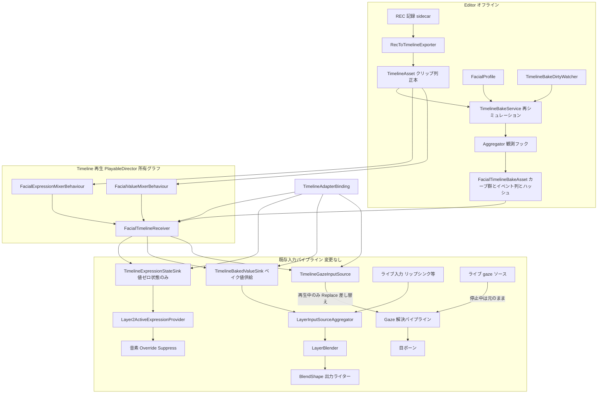
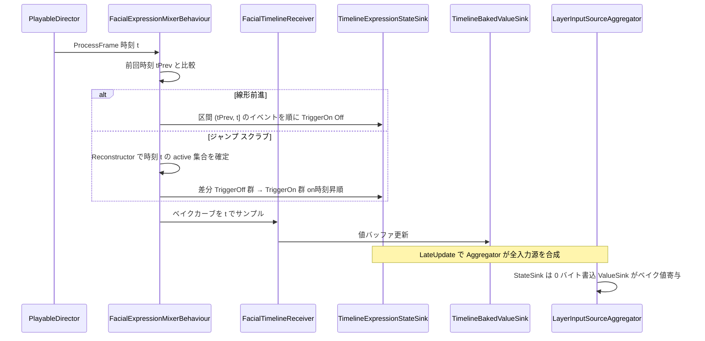
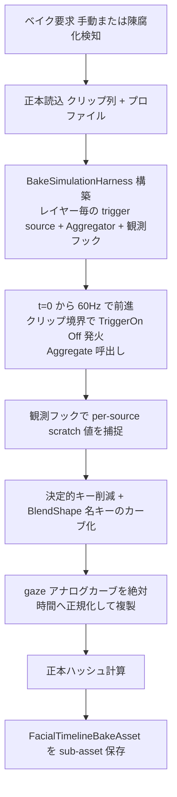
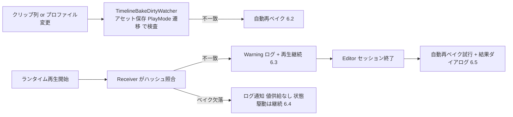

# Technical Design Document — rec-timeline-baking

## Overview

**Purpose**: 本機能は、REC 記録（操作イベント時系列）を Unity Timeline 上のクリップ列として編集・再生可能にする Timeline 統合を Unity エンジニアに提供する。標準 AnimationTrack では表現できない遷移意味論（カスタムカーブ・「遷移中の再トリガーは現在の補間値から開始」）を、独自 Track の mixer が「もう一つの入力アダプター」として本物の入力パイプラインを駆動することで完全再現する。

**Users**: Unity エンジニアが、収録したパフォーマンスの Timeline 編集（クリップ移動・差し替え）、Editor スクラブプレビュー、ライブ本番中のキュー点ジャンプ込み再生に利用する。

**Impact**: 新規 UPM パッケージ `com.hidano.facialcontrol.timeline` を追加する。core への改修は `LayerInputSourceAggregator` へのソース単位値観測フック（加算的・未登録時ゼロ影響）のみ。既存の入力パイプライン・遷移計算・レイヤー合成のコードパスは変更しない。

### Goals
- REC 記録を独自 Track のクリップ列へ書き出し、Unity 標準 Timeline 編集を可能にする（編集後はクリップ列が正本）
- ソース単位（遷移補間済み・レイヤー合成前）のベイク済みカーブを Editor オフラインの再シミュレーションで生成し、値はベイクカーブ・active 表情状態はイベント列の並行駆動でスクラブ/ランダムアクセスを成立させる
- ハッシュによるベイク陳腐化検知（Editor 自動再ベイク + ランタイム警告）
- gaze を正規化 Vector2(-1..1) カーブのまま既存 gaze 解決パイプラインへ流す（リグ非依存）
- ランタイム再生の毎フレーム定常処理 GC ゼロ

### Non-Goals
- 操作イベントの記録機構・core イベント観測点（トリガー/アナログ/gaze）・sidecar 永続化・Timeline 非経由リアルタイム再生（先行 spec `rec-recording-playback` が所掌）
- 音声解析・リップシンク音源の記録、ランタイム UI の提供
- per-clip の遷移時間上書き（OQ1 決定: プロファイル read-only 参照。将来要望が出た場合は別 spec / backlog）
- Timeline 停止時のライブ操作への状態引き継ぎ（rec のリアルタイム再生の役割）

## Boundary Commitments

### This Spec Owns
- 新規パッケージ `com.hidano.facialcontrol.timeline` の全体（独自 Track / クリップ / mixer / sink 群 / ベイク成果物 / Editor ツール）
- ベイク成果物 `FacialTimelineBakeAsset` のスキーマとハッシュ正規形
- core `LayerInputSourceAggregator` へのソース単位値観測フック（本 spec 唯一の core 改修）
- REC 論理イベント形を受け取る `IRecordedEventSequence` 契約（本パッケージ内定義）

### Out of Boundary
- REC 記録の生成・永続化・読込 API の実体（rec spec 所掌。本 spec は adapter 1 ファイルで変換）
- **core の Replace 再バインド伝搬（注入面）の実装**（rec spec Req 6.4 所掌として core に追加予定: 「`IInputSourceRegistry.Replace` 時に消費側 — レイヤー入力・gaze 解決の `EyeBinding` — へ再バインドを伝搬する」注入面。消費側は入力ソースを構築時にキャッシュするため Replace 単体では差し替わらない、という gap 分析結果を受けたユーザー決定・案 2。本 spec はこの注入面を**利用する側**であり、実装・契約定義は行わない）
- `ExpressionTriggerInputSourceBase` / `LayerBlender` / gaze 解決（`GazeBindingConfigResolver` / `GazeBonePoseProvider`）等、core 既存コードパスの変更
- FacialController のデッド PlayableGraph 出力経路（相乗り禁止対象、Req 9.2）

### Allowed Dependencies
- `com.hidano.facialcontrol`（core）: AdapterBinding 契約、入力源基底、Aggregator、gaze 解決、profile
- **core の注入面（rec spec が追加する Replace 再バインド伝搬）**: gaze ソースのライブ⇄Timeline 一時差し替え（Components の TimelineGazeInputSource / Receiver 参照）に利用する
- `com.hidano.facialcontrol.rec`: REC 記録データの読込。**asmdef 参照は Editor asmdef のみ**（Runtime asmdef は rec を参照せず、ランタイム再生コードは rec の型に触れない）。package.json 上は必須依存として宣言する（File Structure Plan 参照）
- `com.unity.timeline` 1.8.9: TrackAsset / PlayableBehaviour / TimelineAsset（本パッケージの package.json でのみ宣言。core / rec へ波及させない — Req 9.4）
- 依存方向制約: timeline Runtime → {core, com.unity.timeline} / timeline Editor → {timeline Runtime, rec, com.unity.timeline}。逆方向参照は禁止。osc / inputsystem / lipsync への依存は禁止

### Revalidation Triggers
- rec spec の design 確定により論理イベント形（トリガー on/off + expressionId + アナログ軸値 + gaze + 秒タイムスタンプ）が変わった場合 → `RecEventSequenceAdapter` と本 design の照合
- **rec spec の design 確定時に、core 注入面（Replace 再バインド伝搬）の契約形状（API 名・伝搬対象範囲・元ソースへの復元可否）を本 design の gaze 差し替え設計（Receiver / TimelineAdapterBinding）と照合**
- core の `IInputSourceRegistry` / `AdapterBuildContext` / `Layer2ActiveExpressionProvider` の契約形状変更
- `FacialTimelineBakeAsset` スキーマまたはハッシュ正規形の変更（ベイク互換性が壊れる）
- `blendshape-output-refactor` spec によるデッド PlayableGraph 撤去（Req 9.2 の前提確認のみ。本設計は当該経路に依存しないため影響なしを確認する）

## Architecture

### Existing Architecture Analysis

- **D-1 ハイブリッド入力モデル**: `ExpressionTrigger`（スタック + 遷移状態機械）と `ValueProvider`（直接値）を `LayerInputSourceAggregator` が weighted-sum + clamp01 で合成し、`LayerBlender` がレイヤー間ブレンドする。本機能の sink 群はすべてこの正道の入力源として参加する
- **アダプター拡張契約**: `AdapterBindingBase` 継承 + `[Serializable]` + `[FacialAdapterBinding]`、`OnStart(in AdapterBuildContext)` で helper MonoBehaviour 生成と `ctx.InputSourceRegistry.Register(slug, source)`。TypeCache 発見 + VContainer host（`AdapterBindingHost`）が lifecycle（OnStart/OnTick/OnLateTick/OnFixedTick/Dispose）を駆動する
- **active 表情解決（系2）**: `Layer2ActiveExpressionProvider` がレイヤー割当済みの `ExpressionTriggerInputSourceBase` 群の `ActiveExpressionIds` を読む。音素 override/suppress はこの provider を参照する
- **gaze チャネル**: 入力 binding が `IInputSource` + `IAnalogInputSource` 両実装の gaze 入力源を registry に登録し、profile の `GazeBindingConfig` 経由で `GazeBonePoseProvider` が解決・適用する。BlendShape 経路（0..1）と別チャネル、値域 -1..1、push 型 `Publish(x, y)`
- **gaze 消費側の構築時キャッシュ**（rec spec gap 分析で実コード確認済み）: レイヤー入力源は `FacialController.InitializeInternal` で 1 回だけ解決され、`GazeBonePoseProvider` の `EyeBinding.Source` は readonly。したがって `registry.Replace` 単体では消費側の参照は差し替わらない。rec spec のユーザー決定（案 2）により「Replace 時に消費側へ再バインドを伝搬する注入面」が core に正式追加される予定で、本設計の gaze ライブ⇄Timeline 切替はこの注入面を利用する
- **時間規約**: 遷移は deltaTime 累積、絶対時刻は `ITimeProvider.UnscaledTimeSeconds` のみ。Timeline の再生ヘッド時刻は mixer の `playable.GetTime()`（PlayableDirector 所有）から取得し、新たな絶対時刻源を追加しない
- **Req 9.2 の明確化**: 独自 Track の mixer は Playables API（`PlayableBehaviour`）を必然的に使用するが、これは PlayableDirector が所有する Timeline 標準の PlayableGraph である。禁止されているのは FacialController 内の**デッド PlayableGraph 出力経路（OscReceiverPlayable 等）への相乗り**であり、Timeline の Playables 使用自体ではない。本設計の mixer は BlendShape 値を出力バスへ一切書かず、入力アダプターの sink を駆動するのみ（Req 1.4）

### Architecture Pattern & Boundary Map



**Architecture Integration**:
- Selected pattern: ソース単位ベイク + 状態イベント並行駆動（値 = ベイクカーブ → `ValueProvider` として合成参加、active 状態 = イベント列 → state-only trigger sink）。代替案の比較は `research.md` の Architecture Pattern Evaluation を参照
- Domain/feature boundaries: Timeline 側（Track/mixer/Receiver）と入力パイプライン側（sink 群）の境界は `FacialTimelineReceiver` が唯一の橋渡し。sink 群は core の入力源基底の派生であり、core から見れば通常の入力アダプター
- Existing patterns preserved: AdapterBinding 拡張契約、slug ベースの入力源登録、gaze の registry + resolver 経路、Unity 標準ログのみのエラーハンドリング
- New components rationale: 各コンポーネントは Components 章を参照
- Steering compliance: クリーンアーキテクチャの依存方向、配布単位の独立性、Editor は UI Toolkit、GC ゼロ目標、TDD

### Key Design Decisions

1. **state-only sink は `blendShapeCount = 0` で構築**（Req 5.2 の構造的保証）: `ExpressionTriggerInputSourceBase` の `TryWriteValues` は非 virtual のため override で値出力を止められない。`blendShapeCount = 0` で構築すれば書込みバイト数がゼロになり、`ActiveExpressionIds` のスタック意味論（LIFO・再トリガー位置更新・深度制限）は base のまま維持される。レイヤーに割当てることで `Layer2ActiveExpressionProvider` の解決対象となり、音素 override/suppress がライブと同一機構で動く（Req 5.4）
2. **ベイク取得点は Aggregator 観測フック**（Req 4.2）: `AggregateInternal` の `TryWriteValues` 直後の scratch 内容が「遷移補間済み・レイヤー合成前・pre-weight」の定義そのもの。フックは observer フィールド + null チェック 1 箇所の加算的変更で、未登録時は既存挙動・性能を変えない（rec spec 6.4 と同一の契約思想）
3. **クリップ重なりはレーン分割**: `ClipCaps.None` の Track はクリップ重なりを編集できないため、スタック的に重なる表情はレイヤー親 Track（`FacialExpressionTrack`）配下の子レーン Track に振り分ける。イベントの時刻順統合はレイヤー親 Track の mixer が一元管理し、順序決定性を保証する
4. **ベイクカーブは BlendShape 名キー**（Req 7.4 と同思想のリグ非依存）: ベイク成果物はインデックスではなく BlendShape 名でカーブを保持し、`OnStart` 時に現在のリグの名前配列へ 1 回だけ解決する
5. **gaze はライブソースの一時差し替え（Replace 再バインド伝搬の利用）**: gaze 消費側（`EyeBinding.Source`）は構築時固定のため、`GazeBindingConfig` への静的 timeline 配線ではライブ gaze と Timeline gaze が共存できない。再生セッション開始時に「`GazeBindingConfig` が参照する既存ライブ gaze ソース」を `TimelineGazeInputSource` へ `Replace`（core 注入面が消費側へ再バインド伝搬）し、停止時に元ソースへ復元する。ユーザーの `GazeBindingConfig` は既存のライブ配線のまま変更不要。差し替えの所有と復元保証は `FacialTimelineReceiver`（Components 参照）
6. **状態イベント列は正本クリップ列から graph 構築時に導出**（ベイク成果物に持たない）: 状態イベントをベイク成果物に格納するとベイク欠落時に状態駆動まで失われ、Req 6.4 の graceful degradation と矛盾する。mixer が graph 構築時（アロケーション許容）に Track（子レーン含む）のクリップ列から直接導出することで、ベイク欠落時も状態駆動（override/suppress）は継続し、値供給（表情ソース値 + 連続値）のみが欠落する。代替案は `research.md` 参照
7. **OQ1〜OQ5 の決定**: 遷移時間はプロファイル read-only（OQ1）、削除済み expressionId は「生成して警告 + 検証 API」（OQ2）、Keyframe 直接編集は全面許容・clamp なし（OQ3）、再書き出しは明示指定 + 確認ダイアログ（OQ4）、新規パッケージ配置（OQ5）。各決定の代替案とトレードオフは `research.md` の Design Decisions を参照

### Technology Stack

| Layer | Choice / Version | Role in Feature | Notes |
|-------|------------------|-----------------|-------|
| Timeline 統合 | `com.unity.timeline` 1.8.9 | TrackAsset / PlayableBehaviour / TimelineAsset / IPropertyPreview | 本パッケージのみが依存宣言（Req 9.4） |
| 入力パイプライン | `com.hidano.facialcontrol`（core） | AdapterBinding 契約・入力源基底・Aggregator・gaze 解決 | 観測フック追加以外は無改修 |
| REC 読込 | `com.hidano.facialcontrol.rec` | 書き出し時の記録読込（Editor asmdef のみが参照） | 論理形 `IRecordedEventSequence` で切り離す。package.json では必須依存 |
| ベイク成果物 | ScriptableObject（TimelineAsset の sub-asset） | 値カーブ群 + ハッシュ（状態イベントは持たない — Key Design Decisions 6） | JSON ではなく SO（Editor 生成物・AnimationCurve 序列化の自然形） |
| Editor UI | UI Toolkit + Timeline ClipEditor/TrackEditor | 書き出しウィンドウ・検証表示 | steering 契約（IMGUI 新規禁止。ClipEditor の描画 API は Timeline 標準の範囲で使用） |

## File Structure Plan

### Directory Structure

```
FacialControl/Packages/com.hidano.facialcontrol.timeline/
├── Runtime/
│   ├── Hidano.FacialControl.Timeline.asmdef   # 参照: Domain, Application, Adapters, Unity.Timeline（rec は参照しない）
│   ├── Domain/                                # Unity Timeline 非依存の純ロジック（asmdef は Runtime と共有）
│   │   ├── Models/
│   │   │   ├── TimelineStateEvent.cs          # 状態イベント (time, kind, expressionId, layerName)。graph 構築時にクリップ列から導出（非シリアライズ）
│   │   │   └── RecordedEvent.cs               # IRecordedEventSequence + RecordedEvent（rec 論理形の契約。実装は Editor 側 adapter）
│   │   └── Services/
│   │       ├── TimelineEventStateReconstructor.cs  # イベント列 → 任意時刻の active 集合確定（5.3）
│   │       └── FacialTimelineHashCalculator.cs     # 正本の正規形ハッシュ（6.1/6.3、Editor/Runtime 共用）
│   └── Adapters/                              # Unity / Timeline 依存
│       ├── AdapterBindings/
│       │   └── TimelineAdapterBinding.cs      # 正道の接続点（9.1）。sink 構築・登録・Receiver 生成
│       ├── InputSources/
│       │   ├── TimelineExpressionStateSink.cs # ExpressionTriggerInputSourceBase(blendShapeCount=0) 派生
│       │   ├── TimelineBakedValueSink.cs      # ValueProviderInputSourceBase 派生。ベイク値バッファ供給
│       │   ├── TimelineGazeInputSource.cs     # IInputSource + IAnalogInputSource（GazeVector2InputSource 同型）
│       │   └── TimelineAnalogInputSource.cs   # アナログ軸チャネル sink（同上の scalar/N-axis 版）
│       ├── Tracks/
│       │   ├── FacialExpressionTrack.cs       # レイヤー親 Track + 子レーン管理
│       │   ├── FacialExpressionClip.cs        # expressionId を持つ PlayableAsset
│       │   ├── FacialExpressionMixerBehaviour.cs  # イベント統合・状態駆動・ベイク値駆動・プレビュー
│       │   ├── FacialValueTrack.cs            # アナログ/gaze 連続値 Track
│       │   ├── FacialValueClip.cs             # AnimationCurve 群を持つ PlayableAsset
│       │   └── FacialValueMixerBehaviour.cs   # カーブサンプル → sink 駆動
│       ├── FacialTimelineReceiver.cs          # Track binding 対象 MonoBehaviour。sink 集約・ハッシュ照合
│       └── Bake/
│           └── FacialTimelineBakeAsset.cs     # ベイク成果物 SO（スキーマは Data Models 参照）
├── Editor/
│   ├── Hidano.FacialControl.Timeline.Editor.asmdef   # 参照: Timeline(Runtime), rec(Runtime), Unity.Timeline + TimelineEditor。rec 参照はここだけ
│   ├── Export/
│   │   ├── RecToTimelineExporter.cs           # REC → クリップ列変換 + 上書き確認（2.x, 3.4）
│   │   └── RecEventSequenceAdapter.cs         # rec 実フォーマット → IRecordedEventSequence（依存封じ込め）
│   ├── Bake/
│   │   ├── TimelineBakeService.cs             # 再シミュレーションベイク（4.x）
│   │   ├── BakeSimulationHarness.cs           # オフライン入力パイプライン構築 + 観測フック受け
│   │   └── TimelineBakeDirtyWatcher.cs        # 陳腐化検知 → 自動再ベイク + セッション後ダイアログ（6.2, 6.5）
│   ├── Validation/
│   │   └── FacialTimelineValidator.cs         # expressionId / gaze 値域の事前検証（2.5, 3.3, OQ2/OQ3）
│   └── TrackEditors/
│       ├── FacialExpressionClipEditor.cs      # 無効 expressionId のクリップ表示（ClipEditor）
│       └── FacialExpressionTrackEditor.cs     # レーン Track の編集補助
├── Tests/
│   ├── EditMode/                              # 変換・ハッシュ・再構築・ベイク決定性（純ロジック）
│   ├── PlayMode/                              # ライブ等価・スクラブ・GC ゼロゲート・共存
│   └── Shared/                                # Fake sink / テストプロファイル
├── Documentation~/
├── package.json                               # deps: core, rec, com.unity.timeline 1.8.9
└── README.md / CHANGELOG.md / LICENSE.md
```

> Tests / asmdef / package.json は既存拡張パッケージ（osc / inputsystem）と同一パターン。Samples~ はプレリリース同梱物が未定のため本 spec のスコープ外とする。

**rec 依存の宣言形**: `com.hidano.facialcontrol.rec` は Editor asmdef のみが参照するが、**package.json では必須依存として宣言する**（UPM には optional 依存の表現がなく、宣言しないと rec 未導入環境で Editor asmdef がコンパイル不能になる）。本パッケージは rec の後続 spec であり、REC 書き出し（Req 9.5）が主要ユースケースであるため必須依存は妥当。versionDefines による optional 化との比較は `research.md` 参照。Runtime asmdef が rec を参照しないことは asmdef の参照リストで物理的に強制する。

### Modified Files
- `FacialControl/Packages/com.hidano.facialcontrol/Runtime/Domain/Services/LayerInputSourceAggregator.cs` — ソース単位値観測フック（`ILayerSourceValueObserver` の設定 API + `AggregateInternal` 内の null チェック付き通知 1 箇所）を追加。observer 未登録時の挙動・性能は不変
- `FacialControl/Packages/com.hidano.facialcontrol/Runtime/Domain/Interfaces/ILayerSourceValueObserver.cs` — 新規（core Domain。フックの契約）

## System Flows

### ランタイム再生（線形再生とジャンプ）



- 状態イベント列は graph 構築時に正本クリップ列（子レーン含む）から導出して `Reconstructor` に設定する（ベイク成果物には格納しない — Key Design Decisions 6。構築時のためアロケーション許容）
- 状態確定は「イベント列の走査 + 集合差分」であり遷移計算の再実行を伴わない（Req 5.3 の「再シミュレーションなし」）
- 同一評価内の複数イベントは記録時刻 + 安定ソートで順序決定。ジャンプ時の TriggerOn 再発行は「最後に on になった時刻」昇順で行い、LIFO スタック順序を復元する
- gaze / アナログは `FacialValueMixerBehaviour` が毎評価ベイク成果物の絶対時間カーブをサンプルし `Publish` / `Write` する（分岐なしの単純経路のため図から省略）
- 再生セッション開始時（最初の評価）に Receiver がベイク検査（6.3/6.4）と gaze ソース差し替え（Replace 再バインド伝搬）を行い、graph 停止/破棄で全解除 + gaze 元ソース復元を行う

### Editor ベイク（再シミュレーション）



- ベイク時の trigger source は `blendShapeCount = プロファイル内全 Expression の BlendShape 名の和集合数` で構築し、リグ非依存にベイクする
- 連続値（gaze / アナログ）は変換を伴わないため再シミュレーション対象外とし、クリップのカーブをクリップ開始オフセット適用済みの絶対時間カーブとして複製する（Req 7.3: gaze はボーン回転を焼かない）

### ベイク陳腐化検知



## Requirements Traceability

| Requirement | Summary | Components | Interfaces | Flows |
|-------------|---------|------------|------------|-------|
| 1.1 | 独自 Track 提供 | FacialExpressionTrack, FacialValueTrack | TrackAsset 派生 | — |
| 1.2 | mixer が入力パイプライン駆動 | 両 MixerBehaviour, Receiver, sink 群 | ITimelineSinkAccess | ランタイム再生 |
| 1.3 | 遷移計算をライブと同一コードパス | BakeSimulationHarness（値）, StateSink（状態） | 観測フック | ベイク |
| 1.4 | 合成済み値を直接書かない | sink 群（入力源として参加） | IInputSource | 境界図 |
| 1.5 | 線形再生でライブと同一結果 | TimelineBakeService（60Hz + epsilon 検証） | — | ベイク |
| 2.1–2.3 | REC → クリップ列変換 | RecToTimelineExporter | IRecordedEventSequence | — |
| 2.4 | TimelineAsset として保存 | RecToTimelineExporter | AssetDatabase | — |
| 2.5 | 無効 expressionId の安全な書き出し | Exporter, FacialTimelineValidator | — | — |
| 3.1 | Unity 標準編集操作 | Track/Clip 定義, TrackEditors | ClipCaps | — |
| 3.2 | 編集後クリップ列が正本 | TimelineBakeService（クリップ列から再生成） | — | ベイク |
| 3.3 | 無効クリップの安全再生 + 通知 | StateSink（core 挙動）, Receiver, Validator | — | — |
| 3.4 | 無警告上書き禁止 | RecToTimelineExporter（確認ダイアログ） | — | — |
| 4.1 | ソース単位・pre-blend ベイク | BakeSimulationHarness | ILayerSourceValueObserver | ベイク |
| 4.2 | Aggregator 観測フック | LayerInputSourceAggregator（改修） | ILayerSourceValueObserver | ベイク |
| 4.3 | Editor オフライン限定 | TimelineBakeService（Editor asmdef） | — | ベイク |
| 4.4 | クリップ列 + プロファイルから再生成 | TimelineBakeService | — | ベイク |
| 4.5 | ベイク決定性 | BakeSimulationHarness（固定レート・決定的キー削減） | — | ベイク |
| 5.1 | 値=ベイク / 状態=イベントの並行駆動 | ExprMixer, ValueSink, StateSink | — | ランタイム再生 |
| 5.2 | イベント側は値を出力しない | TimelineExpressionStateSink（blendShapeCount=0） | — | ランタイム再生 |
| 5.3 | ジャンプ先の即時確定 | TimelineEventStateReconstructor | JumpTo | ランタイム再生 |
| 5.4 | override/suppress がライブ同一 | StateSink → Layer2ActiveExpressionProvider | ActiveExpressionIds | 境界図 |
| 5.5 | ライブ入力とのレイヤー合成共存 | ValueSink（Aggregator 参加） | IInputSource | 境界図 |
| 5.6 | Editor スクラブプレビュー | ExprMixer/ValMixer の Editor 分岐, GatherProperties | IPropertyPreview | — |
| 6.1 | ハッシュ記録 | FacialTimelineHashCalculator, BakeAsset | ComputeHash | ベイク |
| 6.2 | Editor 自動再ベイク | TimelineBakeDirtyWatcher | IsStale | 陳腐化検知 |
| 6.3 | ランタイム不一致警告 + 継続 | FacialTimelineReceiver | — | 陳腐化検知 |
| 6.4 | ベイク欠落通知 | FacialTimelineReceiver（値供給なし・状態駆動は継続） | — | 陳腐化検知 |
| 6.5 | セッション後修復ダイアログ | TimelineBakeDirtyWatcher | — | 陳腐化検知 |
| 7.1 | gaze を Vector2 カーブで扱う | FacialValueTrack/Clip | — | — |
| 7.2 | gaze 解決パイプラインへ供給 | TimelineGazeInputSource, ValMixer, Receiver（ライブソース差し替え） | Publish, Replace 再バインド伝搬 | 境界図 |
| 7.3 | ボーン回転を焼かない | TimelineBakeService（連続値は複製のみ） | — | ベイク |
| 7.4 | プロファイル・リグ追従 | 名前キーのカーブ + 既存 resolver 経由（GazeBindingConfig はライブ配線のまま） | GazeBindingConfig | — |
| 8.1 | 毎フレーム GC ゼロ | 全ランタイムコンポーネント（事前確保） | — | — |
| 8.2 | 時間規約整合 | mixer（playable.GetTime のみ） | — | — |
| 8.3 | ベイクはヒープ許容 | TimelineBakeService | — | — |
| 9.1 | AdapterBinding 正道 | TimelineAdapterBinding | AdapterBindingBase | 境界図 |
| 9.2 | デッド経路非依存 | 全コンポーネント（設計制約） | — | — |
| 9.3 | core コードパス不変更 | 観測フックのみ（加算的） | — | — |
| 9.4 | Timeline 依存の局所化 | 新規パッケージ package.json | — | — |
| 9.5 | REC 記録データを入力可能 | RecEventSequenceAdapter | IRecordedEventSequence | — |

## Components and Interfaces

| Component | Domain/Layer | Intent | Req Coverage | Key Dependencies (P0/P1) | Contracts |
|-----------|--------------|--------|--------------|--------------------------|-----------|
| TimelineAdapterBinding | Runtime/Adapters | sink 構築・登録と Receiver 生成の正道接続点 | 1.2, 9.1, 9.3 | AdapterBuildContext (P0) | Service |
| FacialTimelineReceiver | Runtime/Adapters | Track binding 対象。sink 集約・ハッシュ照合・gaze ソース差し替えの所有 | 1.2, 6.3, 6.4, 7.2 | BakeAsset (P0), sink 群 (P0), core 注入面 (P0) | Service, State |
| TimelineExpressionStateSink | Runtime/Adapters/InputSources | 状態のみ供給する trigger sink | 5.1, 5.2, 5.4 | ExpressionTriggerInputSourceBase (P0) | State |
| TimelineBakedValueSink | Runtime/Adapters/InputSources | ベイク値の ValueProvider 供給 | 1.4, 5.1, 5.5 | ValueProviderInputSourceBase (P0) | State |
| TimelineGazeInputSource / TimelineAnalogInputSource | Runtime/Adapters/InputSources | gaze / アナログ sink（gaze は再生中のみライブソースと差し替え） | 7.1, 7.2, 7.4 | IAnalogInputSource (P0), core 注入面 (P0) | State |
| FacialExpressionTrack / Clip / レーン | Runtime/Adapters/Tracks | 表情クリップ列の Track 表現 | 1.1, 2.2, 3.1 | Unity.Timeline (P0) | — |
| FacialValueTrack / Clip | Runtime/Adapters/Tracks | 連続値カーブクリップ | 1.1, 2.3, 3.1, 7.1 | Unity.Timeline (P0) | — |
| FacialExpressionMixerBehaviour | Runtime/Adapters/Tracks | イベント統合・状態/値駆動・プレビュー | 1.2, 5.1, 5.3, 5.6 | Reconstructor (P0), Receiver (P0) | Service |
| FacialValueMixerBehaviour | Runtime/Adapters/Tracks | カーブサンプル → sink | 5.1, 7.2, 5.6 | Receiver (P0) | — |
| TimelineEventStateReconstructor | Runtime/Domain | イベント列 → 任意時刻の状態確定 | 5.3 | なし | Service |
| FacialTimelineHashCalculator | Runtime/Domain | 正本の正規形ハッシュ | 6.1, 6.3 | TimelineAsset, FacialProfile (P0) | Service |
| FacialTimelineBakeAsset | Runtime/Adapters/Bake | ベイク成果物 | 4.1, 6.1, 7.3 | — | State |
| Aggregator 観測フック（core 改修） | core Domain/Services | ソース単位値の観測点 | 4.2, 9.3 | — | Event |
| RecToTimelineExporter + Adapter | Editor/Export | REC → クリップ列書き出し | 2.1–2.5, 3.4, 9.5 | rec 読込 API (P1) | Batch |
| TimelineBakeService + Harness | Editor/Bake | 再シミュレーションベイク | 4.1–4.5, 8.3 | 観測フック (P0) | Batch |
| TimelineBakeDirtyWatcher | Editor/Bake | 陳腐化検知・自動再ベイク・修復ダイアログ | 6.2, 6.5 | HashCalculator (P0) | Event |
| FacialTimelineValidator | Editor/Validation | 事前検証（expressionId / gaze 値域） | 2.5, 3.3 | — | Service |

### Runtime / Adapters

#### TimelineAdapterBinding

| Field | Detail |
|-------|--------|
| Intent | AdapterBinding 正道で Timeline 統合の全 sink を構築・登録し、Receiver を宿す |
| Requirements | 1.2, 5.5, 9.1, 9.3 |

**Responsibilities & Constraints**
- `OnStart`: (1) 設定された Track 対応（対象レイヤー名 / gaze・アナログチャネル定義）に従い sink 群を構築、(2) `ctx.InputSourceRegistry.Register(slug, ...)` / `Register(slug, sub, ...)` で登録（gaze: `timeline:gaze-{n}`、アナログ: `timeline:{channel}` 形式）、(3) `ctx.HostGameObject` に `FacialTimelineReceiver` を AddComponent し sink 参照・gaze 差し替え設定（`TakeoverSourceId`）を注入
- `Dispose`: **gaze 差し替えが残っていれば元ソースへ復元（最終防衛線）**した上で Receiver 破棄と sink 解除
- OnTick/OnLateTick は不使用（駆動は Timeline の PlayableGraph 評価が担う）。Aggregator による sink の Tick はレイヤー登録経由で従来どおり行われる
- state sink / value sink のレイヤー割当は既存の slug 駆動レイヤー入力設定に従う（core 無改修）
- gaze の差し替え実行自体は Receiver が所有する（本 binding は設定の保持と Dispose 時の復元保証のみ）

**Dependencies**
- Inbound: AdapterBindingHost — lifecycle 駆動 (P0)
- Outbound: IInputSourceRegistry — sink 登録 (P0) / FacialTimelineReceiver — 橋渡し生成 (P0) / core 注入面（Replace 再バインド伝搬）— Dispose 時の復元 (P0)
- External: なし

**Contracts**: Service [x]

##### Service Interface

```csharp
[Serializable]
[FacialAdapterBinding(displayName: "Timeline")]
public sealed class TimelineAdapterBinding : AdapterBindingBase
{
    /// <summary>表情 Track が駆動する対象レイヤー名の列（Track 側の設定と照合される）。</summary>
    public List<string> ExpressionLayerNames;

    /// <summary>gaze チャネル数と、アナログチャネル定義（sub-id と AxisCount）。</summary>
    public List<TimelineValueChannelConfig> ValueChannels;

    public override void OnStart(in AdapterBuildContext ctx);
    public override void Dispose();
}

[Serializable]
public struct TimelineValueChannelConfig
{
    public string Sub;               // registry の slug:sub の sub 部（例: "gaze-0", "cheek-puff"）
    public int AxisCount;            // gaze は 2 固定
    public bool IsGaze;              // true なら TimelineGazeInputSource として登録

    /// <summary>IsGaze のとき必須。差し替え対象となる既存ライブ gaze ソースの registry id
    /// （GazeBindingConfig が参照している id。例: "osc:eye-gaze-0"）。
    /// ユーザーの GazeBindingConfig は既存のライブ配線のまま変更しない。</summary>
    public string TakeoverSourceId;
}
```

- Preconditions: `ctx.HostGameObject` 非 null（AdapterBuildContext が保証）
- Postconditions: sink 群と Receiver が登録済み。Timeline 未再生時は sink は無効（invalid / 空スタック）かつ gaze 差し替え未実施で、他入力へ影響しない
- Invariants: sink の Id・レイヤー割当は OnStart 後不変。Dispose 完了後に gaze 消費側が timeline sink を参照し続けることはない

#### FacialTimelineReceiver

| Field | Detail |
|-------|--------|
| Intent | Track binding 対象 MonoBehaviour。mixer と sink の唯一の橋渡し + ベイク参照 + ハッシュ照合 + gaze ソース差し替えの所有 |
| Requirements | 1.2, 6.3, 6.4, 7.2 |

**Responsibilities & Constraints**
- mixer から `TryGetStateSink(layerName)` / `TryGetValueSink(layerName)` / `TryGetAnalogSink(sub)` で sink を解決させる（レイヤー名 → sink の辞書は初期化時に構築、以後参照のみ）
- 再生セッション開始時（最初の graph 評価）に 1 回だけ `BeginPlaybackSession`: (1) ベイク成果物の有無確認（欠落 → `Debug.LogWarning` + 値供給なし・状態駆動は継続、Req 6.4）、(2) `FacialTimelineHashCalculator` で正本ハッシュを計算しベイク記録値と照合（不一致 → `Debug.LogWarning` + 継続、Req 6.3）、(3) **gaze ソース差し替え**: 各 gaze チャネルの `TakeoverSourceId` を registry から解決して元ソース参照を退避し、`Replace(takeoverId, timelineGazeSink)` を実行（core 注入面が消費側 `EyeBinding` へ再バインドを伝搬）。照合結果は Editor 側（DirtyWatcher）から読める static フラグ/イベントで公開する（6.5 の入力）
- **gaze 差し替えの復元保証（三重）**: (1) `ReleaseAll`（graph 停止/破棄）で `Replace(takeoverId, 退避した元ソース)`、(2) 自身の `OnDisable`/`OnDestroy` で未復元なら復元、(3) `TimelineAdapterBinding.Dispose` が最終防衛線。復元は冪等（未差し替え時は no-op）
- `TakeoverSourceId` が registry で解決できない場合: `Debug.LogWarning` + 当該 gaze チャネルのみ無効化（他チャネル・他 Track は継続）
- ベイクカーブの BlendShape 名 → sink バッファ index 解決を初期化時に 1 回だけ行う（以後 GC ゼロ）
- graph 停止 / 破棄通知（mixer の `OnPlayableDestroy` 経由）で state sink 全 TriggerOff + value/gaze sink invalidate + gaze 元ソース復元（research.md Decision 参照）

**Dependencies**
- Inbound: 両 MixerBehaviour — sink 解決・ベイクサンプル値の受け渡し (P0)
- Outbound: FacialTimelineBakeAsset — 値カーブ・ハッシュ (P0) / sink 群 (P0) / IInputSourceRegistry + core 注入面（Replace 再バインド伝搬）— gaze 差し替えと復元 (P0)

**Contracts**: Service [x] / State [x]

##### Service Interface

```csharp
public sealed class FacialTimelineReceiver : MonoBehaviour
{
    /// <summary>Exporter / Bake が自動割当する。TimelineAsset の sub-asset を参照する。</summary>
    public FacialTimelineBakeAsset BakeAsset;

    public bool TryGetStateSink(string layerName, out TimelineExpressionStateSink sink);
    public bool TryGetValueSink(string layerName, out TimelineBakedValueSink sink);
    public bool TryGetGazeSink(string sub, out TimelineGazeInputSource sink);
    public bool TryGetAnalogSink(string sub, out TimelineAnalogInputSource sink);

    /// <summary>再生セッション開始処理: ベイク検査（欠落 6.4 / 不一致 6.3）+ gaze ソース差し替え。冪等。</summary>
    public void BeginPlaybackSession(FacialProfile profile, TimelineAsset timeline);

    /// <summary>graph 停止時の全解除 + gaze 元ソース復元。冪等。</summary>
    public void ReleaseAll();
}
```

- Preconditions: `BeginPlaybackSession` は再生経路で最初の `ProcessFrame` から呼ばれる（メインスレッド）。core 注入面（rec spec 追加予定）が存在すること
- Postconditions: `ReleaseAll` 後、全 sink は「他入力源に影響しない」状態（空スタック / invalid）であり、gaze 消費側はライブ元ソースを参照する
- Invariants: sink 辞書は初期化後不変。照合は Warning のみで再生を止めない。差し替えと復元は必ず対で完了する（三重の復元保証）

##### State Management
- State model: ハッシュ照合結果（未検査 / 一致 / 不一致 / ベイク欠落）+ gaze 差し替え状態（未差し替え / 差し替え中 + 退避元ソース参照）を保持
- Persistence & consistency: 非永続（セッション状態）。Editor の DirtyWatcher が参照
- Concurrency strategy: メインスレッド限定（Timeline 評価 + LateUpdate）

#### TimelineExpressionStateSink

| Field | Detail |
|-------|--------|
| Intent | active 表情状態のみを入力パイプラインへ供給する trigger sink（値出力は構造的にゼロ） |
| Requirements | 5.1, 5.2, 5.4 |

**Responsibilities & Constraints**
- `ExpressionTriggerInputSourceBase` 派生を **`blendShapeCount: 0`** で構築する。`TryWriteValues` は 0 要素書込となり値寄与ゼロ（Req 5.2 の構造的保証）。`ActiveExpressionIds` の LIFO 意味論は base のまま
- レイヤーに割当てられることで `Layer2ActiveExpressionProvider` の解決対象となり、音素 override/suppress がライブと同一機構で動く（Req 5.4）
- `maxStackDepth` はライブ側の既定と同値、`ExclusionMode` は対象レイヤーの設定値を使用（状態解釈をライブと一致させる）
- 追加 API なし（TriggerOn/TriggerOff は base の public メソッドをそのまま使用）

**Dependencies**
- Inbound: FacialExpressionMixerBehaviour — TriggerOn/Off 駆動 (P0) / Layer2ActiveExpressionProvider — ActiveExpressionIds 読取 (P0)

**Contracts**: State [x]（base 契約に追加なし）

#### TimelineBakedValueSink / TimelineGazeInputSource / TimelineAnalogInputSource

| Field | Detail |
|-------|--------|
| Intent | ベイク値・gaze・アナログ値を既存合成/解決パイプラインへ供給する ValueProvider 群 |
| Requirements | 1.4, 5.1, 5.5, 7.1, 7.2, 7.4 |

**Responsibilities & Constraints**
- `TimelineBakedValueSink : ValueProviderInputSourceBase` — 事前確保 `float[]`（BlendShape 数）と有効フラグを保持。Receiver がカーブサンプル結果を書込み、`TryWriteValues` がコピーする。`ContributeMask` はベイクに含まれる BlendShape 名から初期化時に構築（触らない BlendShape へ干渉しない — ライブの ContributeMask 思想と同一）
- `TimelineGazeInputSource` — `GazeVector2InputSource`（osc パッケージ）と同型の自前実装（`IInputSource` + `IAnalogInputSource`、`Publish(x, y)`、-1..1、clamp なし、`BlendShapeCount = 0`）。`timeline:gaze-{n}` として registry に常時登録される（診断用）が、gaze 解決への供給は**静的配線ではなく一時差し替え**で行う: 再生セッション開始時に Receiver が `Replace(TakeoverSourceId, 本 sink)` を実行し、core 注入面が消費側 `EyeBinding.Source` を再バインドする。停止時に元のライブソースへ復元される。ユーザーの `GazeBindingConfig` は既存ライブ配線のまま変更不要（Req 7.2/7.4。ボーン回転はこの sink を通らない。ライブ gaze との共存 = 再生中のみ Timeline が当該チャネルを占有し、非再生中はライブが従来どおり機能する）
- `TimelineAnalogInputSource` — N-axis 版。Timeline 非再生時は invalid

**Contracts**: State [x]

##### Service Interface（追加 API のみ）

```csharp
public sealed class TimelineBakedValueSink : ValueProviderInputSourceBase
{
    /// <summary>Receiver がベイクサンプル値を書込む。長さは BlendShapeCount。</summary>
    public void Write(ReadOnlySpan<float> values);
    public void Invalidate();
    public override bool TryWriteValues(Span<float> output); // 有効時のみ true
}
```

- Invariants: `Write` / `TryWriteValues` はヒープ確保なし。Invalidate 中は false を返し他入力源の寄与を妨げない

### Runtime / Tracks

#### FacialExpressionTrack / FacialExpressionClip

| Field | Detail |
|-------|--------|
| Intent | 表情クリップ列の Track 表現（レイヤー親 + 子レーン） |
| Requirements | 1.1, 2.2, 3.1 |

**Responsibilities & Constraints**
- `FacialExpressionTrack : TrackAsset`、`[TrackBindingType(typeof(FacialTimelineReceiver))]`、`[TrackClipType(typeof(FacialExpressionClip))]`。Track プロパティ: 対象レイヤー名
- クリップの重なり（表情スタック）は親 Track 直下の子レーン Track（同型・レイヤー名は親に従属）へ振り分ける。mixer は親 Track が `CreateTrackMixer` で 1 つだけ生成し、graph 構築時に子レーンを含む全クリップを時刻順に収集する。子レーンの mixer は no-op
- `FacialExpressionClip : PlayableAsset, ITimelineClipAsset` — フィールドは `ExpressionId` のみ。`ClipCaps.None`（ブレンド・extrapolation なし。遷移は入力パイプラインが計算するため Timeline 側ブレンドを禁止する）。クリップ開始 = TriggerOn、終了 = TriggerOff
- 遷移時間・カーブはクリップに持たない（OQ1: プロファイル read-only 参照）

**Contracts**: なし（データ定義。挙動は mixer が担う）

#### FacialValueTrack / FacialValueClip

| Field | Detail |
|-------|--------|
| Intent | アナログ / gaze の連続値カーブクリップ |
| Requirements | 1.1, 2.3, 3.1, 7.1 |

**Responsibilities & Constraints**
- Track プロパティ: 対象チャネル sub-id + 種別（Analog / Gaze）。`FacialValueClip` は `AnimationCurve[] Axes`（gaze は長さ 2、値域 -1..1 のまま。クリップローカル時間）
- Keyframe は Unity 標準 Curve Editor で直接編集可（OQ3: 全面許容・clamp なし）。値域検証は `FacialTimelineValidator` の責務
- `ClipCaps.None`。クリップ間の空白区間は sink invalidate（値なし）とする

#### FacialExpressionMixerBehaviour / FacialValueMixerBehaviour

| Field | Detail |
|-------|--------|
| Intent | Timeline 評価を sink 駆動へ変換する。線形再生 / ジャンプ / Editor プレビューの 3 分岐 |
| Requirements | 1.2, 5.1, 5.3, 5.6, 7.2, 8.1, 8.2 |

**Responsibilities & Constraints**
- 時刻は `playable.GetTime()` のみ使用（Req 8.2）。前回評価時刻を保持し、前進が 1 評価分を超える・後退した場合はジャンプとして扱う
- **状態イベント列の導出**: graph 構築時（`CreateTrackMixer` 後の初期化）に Track（子レーン含む）のクリップ列から `TimelineStateEvent` 列（クリップ開始 = on / 終了 = off、時刻昇順・安定ソート）を導出して `TimelineEventStateReconstructor` に設定する。ベイク成果物には依存しない（Key Design Decisions 6 — ベイク欠落時も状態駆動は継続）。構築時のためアロケーション許容
- **ランタイム再生**: System Flows のシーケンス図のとおり。値は Receiver 経由でベイクカーブをサンプル。ベイク欠落時は値供給をスキップし状態駆動のみ行う
- **Editor（非 Play）プレビュー**: `Application.isPlaying == false` の評価では sink を駆動せず、ベイクカーブのサンプル値を binding 対象経由で SkinnedMeshRenderer の BlendShape weight（および gaze 解決結果の目ボーン localRotation）へ直接適用する。適用対象は Track の `GatherProperties`（`IPropertyPreview`）で driven-property 登録し、preview 解除時に Timeline が自動復元する。**この直接適用はプレビュー専用経路であり、Req 1.4（ランタイムの合成委譲）の対象外**。Editor プレビューでは gaze のライブソース差し替えは行わない。ベイク欠落時はプレビュー不可（Scene 変化なし + Console 通知）
- `FacialValueMixerBehaviour`: 毎評価、ベイク成果物の絶対時間カーブ（`ValueBakes`）をサンプルし `Publish` / `Write`。クリップの存在しない区間（クリップ範囲は正本 Track から構築時に取得）は invalidate。ベイク欠落時は常時 invalidate
- `OnPlayableDestroy` / graph 停止で `Receiver.ReleaseAll()`（gaze 元ソース復元を含む）
- 毎評価の定常処理はヒープ確保なし（イベント走査・カーブ Evaluate・差分配列は事前確保）

**Dependencies**
- Inbound: PlayableDirector（Timeline 標準 graph）(P0)
- Outbound: FacialTimelineReceiver (P0) / TimelineEventStateReconstructor (P0)

**Contracts**: Service [x]（PlayableBehaviour override のみ、公開 API なし）

### Runtime / Domain（純ロジック）

#### TimelineEventStateReconstructor

| Field | Detail |
|-------|--------|
| Intent | 状態イベント列から任意時刻の active 表情集合を再シミュレーションなしで確定し、sink への差分駆動を生成する |
| Requirements | 5.3 |

**Contracts**: Service [x]

##### Service Interface

```csharp
/// <summary>sink 抽象（テストで Fake 可能にするための最小契約）。</summary>
public interface ITimelineTriggerSink
{
    void TriggerOn(string expressionId);
    void TriggerOff(string expressionId);
    IReadOnlyList<string> ActiveExpressionIds { get; }
}

public sealed class TimelineEventStateReconstructor
{
    /// <summary>イベント列（時刻昇順・不変）を設定する。内部バッファを事前確保する。</summary>
    public void SetEvents(IReadOnlyList<TimelineStateEvent> events);

    /// <summary>区間 (fromExclusive, toInclusive] のイベントを記録順に発火する（線形前進）。</summary>
    public void AdvanceLinear(double fromExclusive, double toInclusive, ITimelineTriggerSink sink);

    /// <summary>時刻 time の active 集合を確定し、sink の現状態との差分を
    /// TriggerOff 群 → TriggerOn 群（最終 on 時刻昇順）の順で発火する。</summary>
    public void JumpTo(double time, ITimelineTriggerSink sink);
}
```

- Preconditions: `SetEvents` 済み。イベントは時刻昇順（同時刻は元の記録順を保持する安定順序）
- Postconditions: `JumpTo` 後の `sink.ActiveExpressionIds` は「時刻 time までのイベントを順に適用した場合」と集合・スタック順ともに一致する
- Invariants: 両メソッドともヒープ確保なし（走査 index とスクラッチ集合は事前確保）。遷移値の計算は行わない

#### FacialTimelineHashCalculator

| Field | Detail |
|-------|--------|
| Intent | 正本（クリップ列 + プロファイル）の正規形ハッシュを Editor / Runtime 共通ロジックで計算する |
| Requirements | 6.1, 6.3 |

**Contracts**: Service [x]

##### Service Interface

```csharp
public static class FacialTimelineHashCalculator
{
    /// <summary>正本の FNV-1a 64bit ハッシュを返す。再生開始時などの非毎フレーム経路で使用（アロケーション許容）。</summary>
    public static ulong Compute(TimelineAsset timeline, FacialProfile profile);
}
```

- **ハッシュ入力の正規形**（この列挙順で確定。変更はスキーマ変更として扱う）:
  1. 本パッケージの Track のみを Track 名昇順 → 子レーン順に列挙（他 Track 種は無視）
  2. Track ごと: レイヤー名 / チャネル sub-id・種別、クリップを開始時刻昇順に: 開始・終了（double のビット表現）、expressionId（UTF-8）、Value クリップは全 Keyframe の time/value/inTangent/outTangent/mode（float ビット表現）
  3. プロファイル: Expression を id 昇順に: id、transitionDuration、curve 種別 + カスタムカーブ keys、BlendShape (name, value) を name 昇順、対象レイヤーの ExclusionMode・レイヤー構成名
  4. ベイク設定: sampleRate
- Invariants: 同一入力 → 同一値（プラットフォーム非依存: ビット表現ベース）。表示順・アセット GUID 等の非意味情報は含めない

### Core 改修（唯一）

#### LayerInputSourceAggregator 観測フック

| Field | Detail |
|-------|--------|
| Intent | per-source 値（遷移補間済み・pre-weight）の観測点を提供する |
| Requirements | 4.2, 9.3 |

**Responsibilities & Constraints**
- `AggregateInternal` の `TryWriteValues` 直後（weight 適用前）に observer へ通知する。**observer 未登録（null）時は null チェック 1 回のみで既存挙動・性能を変えない**
- Editor オフラインのベイクハーネス専用の想定（ランタイムでの登録は行わない運用。API 上は禁止しないが XML ドキュメントに明記）

**Contracts**: Event [x]

##### Event Contract

```csharp
// core: Runtime/Domain/Interfaces/ILayerSourceValueObserver.cs（新規）
public interface ILayerSourceValueObserver
{
    /// <summary>Aggregate 中、各 (layer, source) の TryWriteValues 直後に呼ばれる。
    /// values は scratch の内容（遷移補間済み・レイヤー合成前・weight 適用前）。isValid=false 時は全ゼロ。</summary>
    void OnSourceValues(int layerIdx, int sourceIdx, IInputSource source,
        ReadOnlySpan<float> values, bool isValid);
}

// core: LayerInputSourceAggregator への追加 API
public void SetSourceValueObserver(ILayerSourceValueObserver observer); // null で解除
```

- Ordering / delivery guarantees: `Aggregate` 呼出しごとに (layer 昇順, source 昇順) で同期呼出し。observer 内での例外は呼出元へ伝播する（Editor 専用運用のため防御しない）

### Editor

#### RecToTimelineExporter / RecEventSequenceAdapter

| Field | Detail |
|-------|--------|
| Intent | REC 記録をクリップ列へ変換し TimelineAsset として保存する |
| Requirements | 2.1–2.5, 3.4, 9.5 |

**Responsibilities & Constraints**
- 変換規則: トリガー on/off 対 → `FacialExpressionClip`（開始 = on 時刻、終了 = off 時刻。off 欠落は記録終端まで）。重なる区間は決定的な貪欲レーン割当（開始時刻順に最初に空いたレーンへ）。アナログ / gaze 連続値 → `FacialValueClip`（記録イベント時刻をそのまま Keyframe とする。リサンプルしない）
- 現在のプロファイルに存在しない expressionId: クリップは生成し `Debug.LogWarning`（クリップ名 + 時刻。OQ2。差し替え修復を可能にするため除外しない）
- 出力先は UI Toolkit ウィンドウで明示指定。既定は新規 TimelineAsset。既存アセット / 既存 Track を指定した場合は確認ダイアログ必須（OQ4、Req 3.4）。書き出し後に `TimelineBakeService` を自動実行し、`FacialTimelineReceiver.BakeAsset` を割当てる
- `RecEventSequenceAdapter` が rec パッケージの実フォーマット読込を `IRecordedEventSequence` へ変換する（rec 依存はこのファイルに封じ込め — Revalidation Trigger 対象）

**Contracts**: Batch [x]

##### Batch / Job Contract
- Trigger: メニュー / ウィンドウからの手動実行
- Input / validation: REC 記録（`IRecordedEventSequence`）、対象プロファイル、出力先パス。イベント時刻の昇順を検証
- Output / destination: TimelineAsset（Track/クリップ列）+ 自動ベイク済み `FacialTimelineBakeAsset`（sub-asset）
- Idempotency & recovery: 同一入力 → 同一クリップ列（決定的レーン割当）。失敗時は AssetDatabase 変更を保存しない

```csharp
/// <summary>rec 論理イベント形の契約（本パッケージ内定義。物理フォーマット非依存）。</summary>
public interface IRecordedEventSequence
{
    double DurationSeconds { get; }
    int Count { get; }
    RecordedEvent this[int index] { get; }   // 時刻昇順
}

public enum RecordedEventKind { TriggerOn, TriggerOff, AnalogValue, GazeValue }

public readonly struct RecordedEvent
{
    public readonly double TimeSeconds;      // 記録開始起点の相対秒
    public readonly RecordedEventKind Kind;
    public readonly string ExpressionId;     // Trigger 系のみ
    public readonly string SourceId;         // Analog / Gaze のチャネル識別子
    public readonly float X;                 // Analog: 軸値 / Gaze: x (-1..1)
    public readonly float Y;                 // Gaze: y (-1..1)
}
```

#### TimelineBakeService / BakeSimulationHarness

| Field | Detail |
|-------|--------|
| Intent | 正本（クリップ列 + プロファイル）からの再シミュレーションでソース単位ベイクを生成する |
| Requirements | 4.1–4.5, 7.3, 8.3, 1.3, 1.5 |

**Responsibilities & Constraints**
- Harness は表情 Track ごとに「trigger source（`ExpressionTriggerInputSourceBase` 派生・blendShapeCount = プロファイル内全 Expression の BlendShape 名和集合数）+ registry + Aggregator + 観測フック」のオフラインパイプラインを構築する。遷移計算は core の実コードが実行する（Req 1.3 のコードパス同一性）
- t = 0 から `sampleRate`（既定 60 Hz、BakeAsset に記録しハッシュに含める）で前進し、各ステップでクリップ境界イベント（同時刻は記録順）を発火 → `Aggregate(1/sampleRate, ...)` → フックで per-source scratch を捕捉する
- キー削減: 直線区間の中間キーを除去する決定的アルゴリズム（誤差しきい値固定）。同一入力 → 同一カーブ（Req 4.5）
- 連続値（gaze / アナログ）は再シミュレーションせず、クリップカーブを絶対時間へオフセット正規化して複製する（gaze はボーン回転を焼かない — Req 7.3）
- 状態イベント列はベイク成果物に格納しない（mixer が graph 構築時に正本クリップ列から導出する — Key Design Decisions 6）
- 削除済み expressionId のクリップ: core の実挙動（目標ゼロ + 既定遷移）どおりに焼き、per-clip 1 回 Warning（OQ2）
- Editor asmdef 配置。ヒープ確保自由（Req 8.3 / 4.3）

**Contracts**: Batch [x]

##### Batch / Job Contract
- Trigger: 書き出し直後の自動実行 / DirtyWatcher の自動再ベイク / メニューの手動実行
- Input / validation: TimelineAsset + FacialProfile。本パッケージ Track が 0 本なら no-op + ログ
- Output / destination: `FacialTimelineBakeAsset`（TimelineAsset の sub-asset として保存・置換）
- Idempotency & recovery: 同一正本 → バイト同一の成果物（Req 4.5）。失敗時は既存ベイクを残す

```csharp
public static class TimelineBakeService
{
    public static FacialTimelineBakeAsset Bake(TimelineAsset timeline, FacialProfile profile);
    public static bool IsStale(TimelineAsset timeline, FacialProfile profile, FacialTimelineBakeAsset bake);
}
```

#### TimelineBakeDirtyWatcher

| Field | Detail |
|-------|--------|
| Intent | 陳腐化検知 → 自動再ベイク（6.2）と、警告済みセッション終了後の修復試行 + ダイアログ（6.5） |
| Requirements | 6.2, 6.5 |

**Responsibilities & Constraints**
- 検査タイミング: (1) アセット保存時（`AssetModificationProcessor.OnWillSaveAssets` で TimelineAsset / プロファイル SO を検出）、(2) Play Mode 遷移時（`EditorApplication.playModeStateChanged`）。検査は `TimelineBakeService.IsStale` で行い、不一致なら自動再ベイク
- Play Mode 中に Receiver が不一致警告を出したセッションの終了（ExitingPlayMode → EnteredEditMode）で自動再ベイクを試行し、成否と失敗理由を `EditorUtility.DisplayDialog` で報告する（Req 6.5。ビルド後ランタイムには存在しない — Editor asmdef）
- Timeline ウィンドウでの編集中の逐次検査は行わない（保存 / Play 開始が検査境界。編集中の未保存状態はプレビューが正本を直接参照するため実害がない）

**Contracts**: Event [x]（Editor コールバック購読。公開 API なし）

#### FacialTimelineValidator

| Field | Detail |
|-------|--------|
| Intent | クリップ列の事前検証（削除済み expressionId / gaze 値域）とレポート |
| Requirements | 2.5, 3.3 |

**Contracts**: Service [x]

```csharp
public static class FacialTimelineValidator
{
    public static FacialTimelineValidationReport Validate(TimelineAsset timeline, FacialProfile profile);
}

public sealed class FacialTimelineValidationReport
{
    public IReadOnlyList<FacialTimelineValidationIssue> Issues { get; }
    public bool HasErrors { get; }
}

public readonly struct FacialTimelineValidationIssue
{
    public readonly FacialTimelineIssueKind Kind;   // MissingExpressionId / GazeOutOfRange / EmptyClip 等
    public readonly string TrackName;
    public readonly string ClipName;
    public readonly double TimeSeconds;
    public readonly string Message;
}
```

- `FacialExpressionClipEditor`（ClipEditor 派生）が MissingExpressionId のクリップにエラー表示を出す。値は変更しない（OQ3: clamp なし）

## Data Models

### Domain Model
- **正本（aggregate root）**: TimelineAsset 上の本パッケージ Track / クリップ列 + 参照プロファイル。編集後の真実は常にここにある（REC 原本は書き出し後の正本ではない — Req 3.2）
- **派生物**: `FacialTimelineBakeAsset`。正本から決定的に再生成可能であり、ハッシュで正本との整合を検証する。派生物の手編集は想定しない
- **不変条件**: BakeAsset.SourceHash == Compute(正本) のとき、かつそのときに限りベイクは新鮮

### Physical Data Model（FacialTimelineBakeAsset）

```csharp
public sealed class FacialTimelineBakeAsset : ScriptableObject
{
    public string SourceHashHex;          // FNV-1a 64bit の hex 文字列（6.1）
    public float SampleRate;              // 既定 60。ハッシュ入力に含む
    public List<ExpressionSourceBake> ExpressionBakes;
    public List<ValueChannelBake> ValueBakes;
    // 状態イベント列は持たない: mixer が graph 構築時に正本クリップ列から導出する
    // （Key Design Decisions 6。ベイク欠落時も状態駆動を継続可能にするため）
}

[Serializable]
public sealed class ExpressionSourceBake
{
    public string LayerName;              // 対応する表情 Track の対象レイヤー
    public List<BlendShapeCurve> Curves;  // 触る BlendShape のみ（sparse）
}

[Serializable]
public sealed class BlendShapeCurve
{
    public string BlendShapeName;         // 名前キー（リグ非依存。2 バイト文字対応）
    public AnimationCurve Curve;          // 絶対 Timeline 時間、値 0..1
}

[Serializable]
public sealed class ValueChannelBake
{
    public string Sub;                    // timeline:{sub} の sub
    public bool IsGaze;                   // gaze は AxisCount 2 / 値域 -1..1 のまま（7.3）
    public AnimationCurve[] Axes;         // 絶対 Timeline 時間へ正規化済み
}

// 非シリアライズのランタイムモデル（graph 構築時にクリップ列から導出）
public struct TimelineStateEvent
{
    public double TimeSeconds;            // Timeline 絶対時間
    public byte Kind;                     // 0 = On, 1 = Off
    public string ExpressionId;
    public string LayerName;              // 駆動先 state sink の解決キー
}
```

- 保存形態: TimelineAsset の sub-asset（アセット移動に追従）。`FacialTimelineReceiver.BakeAsset` が参照する
- 消費: Receiver が初期化時に BlendShapeName → sink index、Sub → sink を解決し、以後はカーブ Evaluate のみ（GC ゼロ）。状態イベント列は BakeAsset ではなく mixer が正本クリップ列から導出する

### Data Contracts & Integration
- `IRecordedEventSequence` / `RecordedEvent`: rec 論理形の契約（Components 章参照）。rec spec の design 確定時に `RecEventSequenceAdapter` のみで吸収する
- `ILayerSourceValueObserver`: core との唯一の新規契約（Components 章参照）

## Error Handling

### Error Strategy
steering 契約どおり Unity 標準ログ（`Debug.Log/LogWarning/LogError`）のみを使用し、カスタム例外型は追加しない。ランタイムは「警告して継続」を原則とし、本番再生を止めない。

### Error Categories and Responses

| シナリオ | 検出点 | 応答 | Req |
|----------|--------|------|-----|
| REC 記録に存在しない expressionId | Exporter | クリップ生成 + Warning（クリップ名・時刻） | 2.5 |
| クリップが削除済み expressionId 参照 | Validator / Bake / ClipEditor | 検証レポート + ベイク時 per-clip Warning + クリップ UI にエラー表示。再生は core の安全挙動で継続 | 3.3 |
| 再書き出しが既存アセットを対象 | Exporter | 確認ダイアログ必須（無警告上書きなし） | 3.4 |
| ランタイムでハッシュ不一致 | Receiver | Warning + 再生継続 | 6.3 |
| ベイク成果物なしで再生開始 | Receiver | ログ通知 + 値供給なし（状態イベントはクリップ列由来のため状態駆動は継続） | 6.4 |
| 警告済みセッション終了（Editor） | DirtyWatcher | 自動再ベイク試行 + 成否ダイアログ | 6.5 |
| gaze カーブが -1..1 範囲外 | Validator | Warning のみ（値は変更しない — ライブ同等） | OQ3 |
| gaze の TakeoverSourceId が registry で解決不能 | Receiver（セッション開始時） | Warning + 当該 gaze チャネルのみ無効化（差し替えせず、他チャネル・再生は継続） | 7.2 準拠 |
| gaze 差し替え中の異常終了（graph 破棄・Receiver 破棄） | Receiver OnDisable/OnDestroy → Binding Dispose | 三重の復元保証で元ソースへ復元（冪等） | 7.2 準拠 |
| Track の対象レイヤー名が binding 設定に不在 | Receiver 初期化 | Warning + 当該 Track を無効化（他 Track は継続） | 3.3 準拠 |
| rec 記録の読込失敗 | Exporter | Error ログ + 書き出し中止（アセット変更なし） | 9.5 |

### Monitoring
- 追加の監視基盤は持たない（steering: Unity 標準ログのみ）。ハッシュ照合結果は Receiver の状態として Editor から参照可能にする（6.5 の連携点）

## Testing Strategy

### Unit Tests（EditMode）
1. `TimelineEventStateReconstructor` — 線形前進とジャンプで active 集合・スタック順が全経路一致（順序復元・同時刻イベントの安定順序を含む）
2. `FacialTimelineHashCalculator` — 同一正本 → 同一値 / クリップ移動・Keyframe 編集・プロファイル遷移時間変更のそれぞれで不一致、非意味情報（Track 表示順以外の並び）で不変
3. Exporter 変換 — on/off 対 → クリップ、重なり → 決定的レーン割当、off 欠落 → 終端まで、未知 expressionId → 生成 + Warning（`LogAssert`）
4. ベイク決定性 — 同一クリップ列 + プロファイルから 2 回ベイクしてカーブのバイト等価（Req 4.5）、キー削減の決定性
5. 観測フック — observer 未登録で既存 Aggregator テストが全緑（挙動不変）、登録時に (layer, source) 順で pre-weight 値が届く

### Integration Tests（PlayMode）
1. **ライブ等価**（Req 1.5）: 同一イベント列を (a) ライブ trigger 駆動、(b) 書き出し → ベイク → Timeline 線形再生、で流し post-blend 出力を許容誤差比較（線形遷移は厳密一致、カーブ遷移は epsilon）
2. **スクラブ/ジャンプ**（Req 5.3/5.4）: 任意時刻へのジャンプ直後の値（ベイクサンプル）と active 状態（override/suppress の発火）が線形到達時と一致
3. **レイヤー共存**（Req 5.5）: Timeline 再生中に Fake リップシンク入力を並走させ、既存合成で共存すること
4. **gaze 経路**（Req 7.2/7.4): gaze カーブ → `Publish` → `GazeBonePoseProvider` で目ボーンが動き、プロファイル差し替えで追従すること
5. **停止時解除**: graph 停止で state sink 全解除 + value sink invalidate、他入力源へ影響しないこと

### Performance Tests（PlayMode）
1. Timeline 再生中の定常フレーム GC ゼロ（`FacialControllerGcZeroGateTests` の ProfilerRecorder パターンを踏襲、Req 8.1）
2. ジャンプ（キュー点移動）評価フレームの GC ゼロ（再構築スクラッチが事前確保であること）
3. 観測フック未登録時の Aggregator アロケーション非退行

> 既知の pre-existing 赤（`SampleAssetsAreInSyncTests` 4 件 / OSC heartbeat 系 / `TenIndependentBindings_OneSwap`）は本 spec の FAIL 判定に含めない。

## Performance & Scalability

- **GC ゼロ対象**: mixer 評価（イベント走査・カーブ Evaluate・差分駆動）、Receiver の sink 書込み、sink の TryWriteValues / Publish。初期化時（OnStart / 再生開始時のハッシュ照合・名前解決）はアロケーション許容
- **ジャンプコスト**: O(イベント総数) の走査上限（バイナリサーチ + 前方replay）。プリセット上限 512 / 実用的な記録長では 1 フレーム内で完了する想定。スクラッチは事前確保
- **時間管理**: 再生ヘッドは `playable.GetTime()`、遷移進行は Aggregator 経由の deltaTime 累積のみ。新規の絶対時刻源なし（Req 8.2）
- **ベイクサイズ**: sparse カーブ（触る BlendShape のみ）+ キー削減で抑制。10 体同時制御時も BakeAsset は共有参照（キャラクターごとの複製なし）

## Migration Strategy

新規パッケージのため移行はない。導入手順のみ:
1. `com.hidano.facialcontrol.timeline` を導入（UPM が core / rec / com.unity.timeline を解決）
2. `FacialCharacterProfileSO` に `TimelineAdapterBinding` を追加し、対象レイヤー / チャネルを設定（gaze を使う場合は `GazeBindingConfig` に `timeline:gaze-{n}` を配線）
3. REC 記録を Exporter で TimelineAsset へ書き出し（ベイクは自動生成）、PlayableDirector の Track binding に `FacialTimelineReceiver` を割当てる

実装順序の制約: `RecEventSequenceAdapter` は rec spec の読込 API 確定後にのみ実装可能。それ以外（Track / mixer / sink / ベイク / ハッシュ）は `IRecordedEventSequence` の Fake で先行実装できる。
